# Roche | Pharma Data Platform on Google Cloud

> End-to-end data engineering portfolio project built on **real public data** about Roche and Genentech products: FDA adverse event reports, Medicare drug spend and clinical trials. Batch and streaming ingestion, a lakehouse on Cloud Storage + BigQuery, dbt transformations with 58 data quality tests, keyless CI/CD on GitHub Actions and an executive Power BI report.

**[Open the live dashboard (Power BI)](https://app.powerbi.com/view?r=eyJrIjoiN2M1NDk2NzMtZjk2Zi00NmMzLTk0ZDMtYTBlM2E3YmUyMzQ0IiwidCI6ImRlODdjNWRjLTBhMzctNDVlMi1hNzhhLTM3NDg0ODE0MDNiZiJ9)**

> **Disclaimer:** independent portfolio project, not affiliated with or endorsed by Roche. All data is public. Adverse event reports (FAERS) do not establish causality, and disproportionality results are statistical signals for medical review, not conclusions.

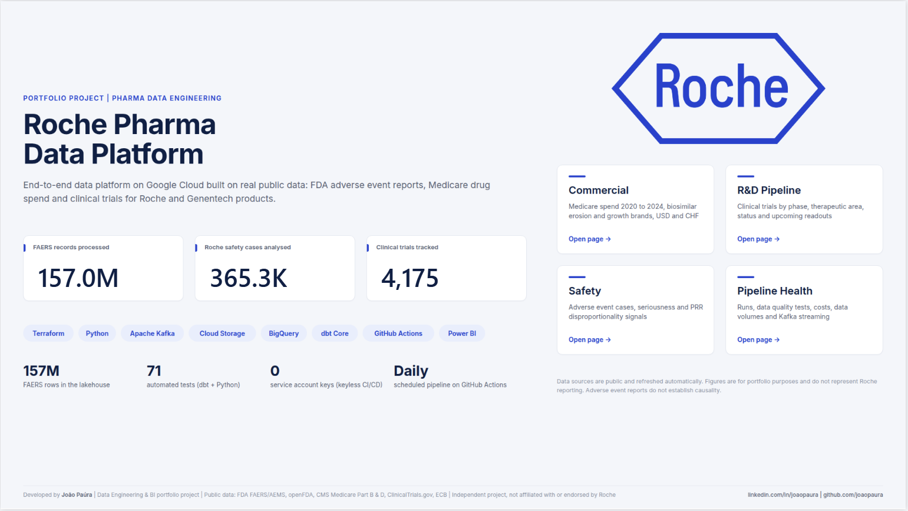

---

## At a glance

| | |
|---|---|
| **Data volume** | 157M FAERS rows (26 quarters, 2020 Q1 to 2026 Q2), 10.4 GB of text compressed to 1.9 GB of Parquet |
| **Sources** | FDA FAERS / AEMS, openFDA recalls, CMS Medicare Part B & D, ClinicalTrials.gov API v2, ECB FX rates |
| **Infrastructure** | 48 Google Cloud resources provisioned with Terraform, zero service account keys |
| **Transformations** | 32 dbt models, 1 SCD2 snapshot, 58 dbt data tests + 13 Python unit tests (71 automated tests), 100% passing |
| **Automation** | Daily and monthly pipelines + CI on every pull request (GitHub Actions) |
| **Streaming** | Kafka intake with validation and dead-letter queue (100% of faulty events caught) |
| **Cost** | about US$0.23 of BigQuery processing for the full build (inside the free tier) |

## Stack

`Python` `Apache Kafka` `Docker` `Terraform` `Google Cloud Storage` `BigQuery` `dbt Core` `GitHub Actions` `Workload Identity Federation` `Power BI` `DAX` `TMDL`

## Architecture

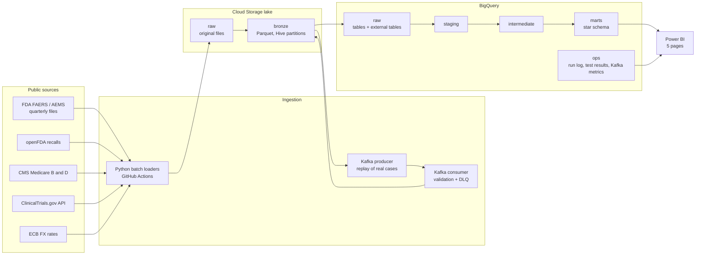

Everything above is created by **Terraform** (buckets, datasets, external tables, service accounts, IAM, Workload Identity Federation). Authentication is **keyless** end to end: service account impersonation on the laptop, OIDC federation in GitHub Actions.

---

## What the report shows

### Commercial | US Medicare spend
Real Medicare Part B and Part D spend on Roche products, 2020 to 2024, in USD and CHF (Roche reporting currency, converted at ECB annual average rates).

- 2024 spend **$7.57bn (+7.4%)** even with a **71% erosion** of products that lost exclusivity since 2020 (Avastin, Herceptin, Rituxan...)
- Growth brands (launched 2016+) reached **58.7% of spend (+6.5 pp)**; their index went from 100 to **267**
- **Vabysmo** is the #1 product at **$1.94bn**, ahead of Ocrevus ($864M)

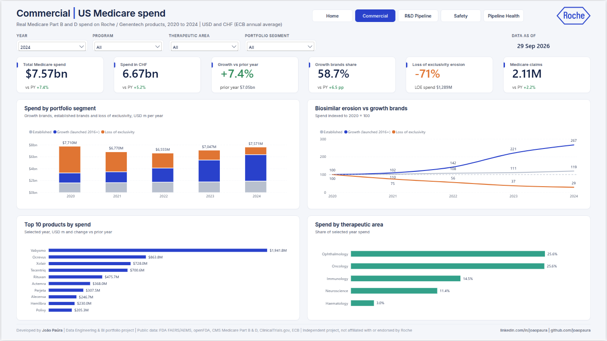

### R&D Pipeline | Clinical trials
4,175 studies with Roche or Genentech as sponsor or collaborator, status history kept with a dbt snapshot (SCD type 2).

- **2,612 Roche-led trials**, **247 active**, **95 active Phase 3**
- **90 readouts** expected in the next 12 months (25 in Phase 3)
- Oncology concentrates **101 of 228** active interventional trials

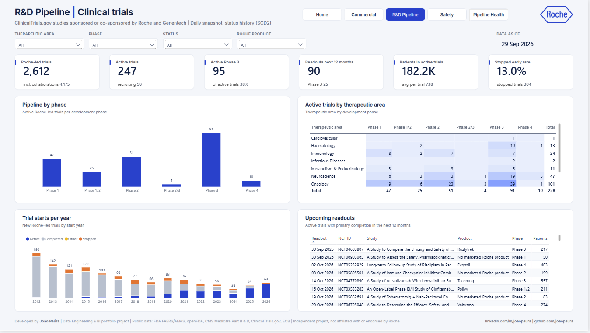

### Safety | Pharmacovigilance
FDA adverse event reports where a Roche product is the primary suspect drug, with disproportionality analysis (PRR, Evans criteria).

- **365K cases** (latest case version), 61% serious, 54% reported by health professionals
- **9,901 reportable signals** out of 29K product and reaction pairs evaluated
- Signals match known safety profiles, for example **Ocrevus: infusion related reaction (PRR 8.5), infections, COVID-19 (PRR 13.7)**

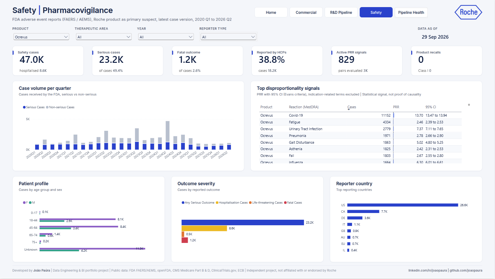

### Pipeline Health | Data platform
The platform monitors itself: every ingestion run, dbt model and test and Kafka micro-batch is logged to the `ops` dataset.

- **100% run success**, **231 dbt tests passed**, **1.9%** of streaming events routed to the dead-letter queue
- BigQuery cost of the full build estimated at **$0.23**

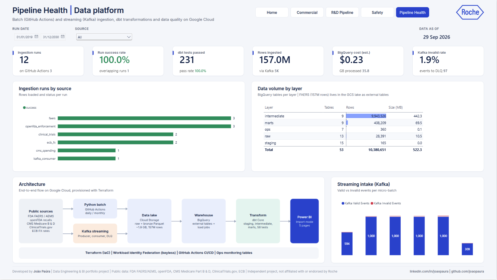

---

## Engineering decisions (and why)

| Decision | Why |
|---|---|
| **Lakehouse for FAERS** | 157M rows would take ~10 GB in BigQuery storage. FAERS stays as Parquet in Cloud Storage (1.9 GB) and is read through **external tables with Hive partitioning**; dbt only materialises the Roche subset and aggregates. |
| **Idempotent loads** | Every file has a deterministic path (`bronze/faers/<table>/quarter=YYYYQn/`); reruns overwrite instead of duplicating, and quarters already loaded are skipped. |
| **Keyless security** | No JSON keys anywhere. Least-privilege service accounts per workload (ingestion, dbt, Power BI), impersonation locally, **Workload Identity Federation** restricted to this repository in CI. |
| **At-least-once streaming** | The Kafka consumer commits offsets only **after** the micro-batch is safely in GCS and BigQuery. Duplicates from re-delivery are removed in dbt by `event_id`. Streaming loads use GCS files + load jobs (free) instead of streaming inserts. |
| **Schema drift tolerance** | CMS files add one column per year. They are kept wide and all-string in raw and unpivoted in dbt with a loop over `var('cms_years')`. FAERS columns are standardised to a fixed schema at ingestion. |
| **Observability as data** | `ops.ingestion_runs`, `ops.kafka_consumer_metrics` and `ops.dbt_run_results` (written by an `on-run-end` hook with bytes billed) feed the Pipeline Health page. |
| **CI on real data, safely** | Pull requests run `dbt build --target ci` into an auto-expiring `dbt_ci` dataset, plus pytest and `terraform validate`. |

## Data quality stories found during the build

These are real issues found while validating the data. They are the most interesting part of the project.

1. **Case deduplication.** FAERS had 11.2M report rows but only 9.5M unique cases: follow-up reports resend the same case. Keeping only the latest `caseversion` per `caseid` (FDA rule) removed an 18% overcount.
2. **Biosimilar attribution.** "Rituximab" or "bevacizumab" in a report is not always Roche: biosimilars share the molecule name. A curated seed of 109 aliases attributes a case to Roche when the **brand name** is reported, and uses the generic name only when **Roche sent the report**.
3. **Confounding by indication.** The first PRR run flagged "Multiple Sclerosis" (PRR 25) as a signal for Ocrevus, which is the disease being treated. The pipeline now reads the FAERS indications table and flags these terms.
4. **Non-clinical terms.** "Off Label Use", "Drug Ineffective" or "No Adverse Event" are product-use or administrative MedDRA terms, not reactions. A dbt macro excludes them from reportable signals.
5. **Concurrent runs.** A FAERS load was started twice by mistake and both ran at the same time. Idempotent paths kept the data correct; the `ops_ingestion_runs` model now flags overlapping runs and GitHub Actions uses a shared `concurrency` group.
6. **Honest KPIs.** Summing Medicare beneficiaries across products counts the same patient several times, so the report shows claims instead.

## Known limitations

- Disproportionality is a **screening method**. Some remaining signals are manifestations of the treated disease that exact indication matching does not catch (for example Hemlibra and haemorrhage in haemophilia). They require medical review.
- FAERS is a spontaneous reporting system: under-reporting, stimulated reporting and duplicates across manufacturers exist.
- Medicare covers mostly patients aged 65+ and is only part of US sales. Spend is not Roche revenue.
- Partner products (Venclexta with AbbVie, Xolair with Novartis) include reports sent by the partner.
- The Kafka stream is a **replay of real FAERS cases** sent by Roche group companies, used to demonstrate the streaming pattern; it runs locally with Docker.

---

## Repository structure

| Folder | Content |
|---|---|
| `terraform/` | Lake bucket, BigQuery datasets, external tables, service accounts, IAM, Workload Identity Federation |
| `ingestion/common/` | Config, keyless auth, HTTP retries, GCS / BigQuery helpers, run tracker |
| `ingestion/batch/` | Loaders: `faers`, `cms_spending`, `clinical_trials`, `openfda_enforcement`, `ecb_fx` |
| `ingestion/streaming/` | Kafka event contract, producer, consumer with DLQ and metrics |
| `kafka/` | Docker Compose: Kafka 4.0 (KRaft), topic init, Kafka UI |
| `dbt/` | Seeds, macros, staging, intermediate, marts, ops, snapshot, tests, exposure |
| `.github/workflows/` | `ci.yml`, `daily-pipeline.yml`, `faers-monthly.yml` |
| `powerbi/` | Power BI project (PBIP), theme, page backgrounds, TMDL relationships and DAX measures |
| `tests/` | Unit tests for parsers and the streaming event contract |
| `tools/` | Raw layer profiling script |
| `docs/screenshots/` | Report, Kafka, GitHub Actions and dbt screenshots |

## How to run it

```bash
# 1. Infrastructure (after creating a GCP project and the Terraform state bucket)
cd terraform && terraform init && terraform apply

# 2. Batch ingestion (keyless: gcloud auth application-default login + IMPERSONATE_SA in .env)
python -m ingestion.batch.ecb_fx
python -m ingestion.batch.clinical_trials
python -m ingestion.batch.openfda_enforcement
python -m ingestion.batch.cms_spending
python -m ingestion.batch.faers --start 2020Q1 --end 2026Q2

# 3. Streaming (Docker)
docker compose -f kafka/docker-compose.yml up -d
python -m ingestion.streaming.consumer --idle-timeout 180      # terminal 1
python -m ingestion.streaming.producer --quarter 2026Q2 --limit 5000   # terminal 2

# 4. Transformations
cd dbt && dbt deps && dbt build

# 5. Tests
pytest
```

<details>
<summary>More screenshots (Kafka, GitHub Actions, dbt)</summary>

| | |
|---|---|
| Kafka dead-letter queue | 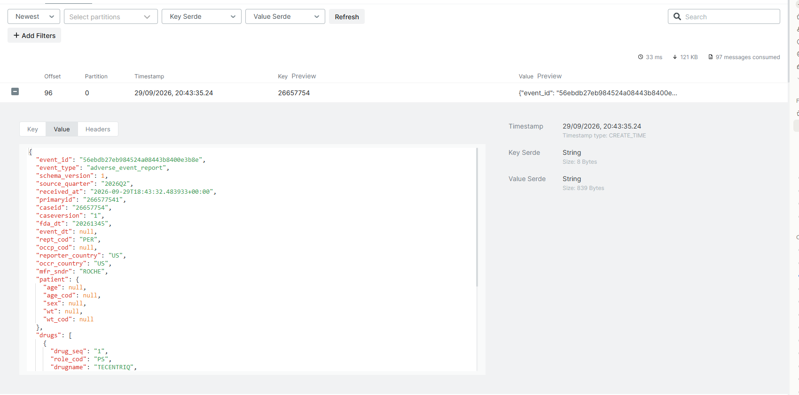 |
| Kafka consumer lag | 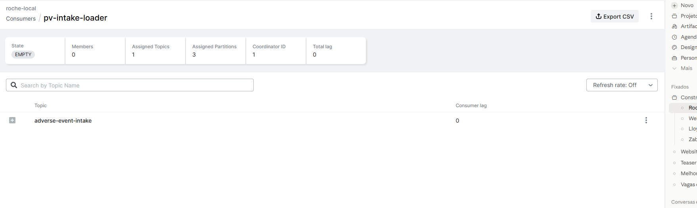 |
| Consumer micro-batches | 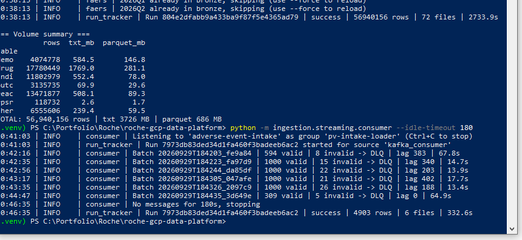 |
| Daily pipeline | 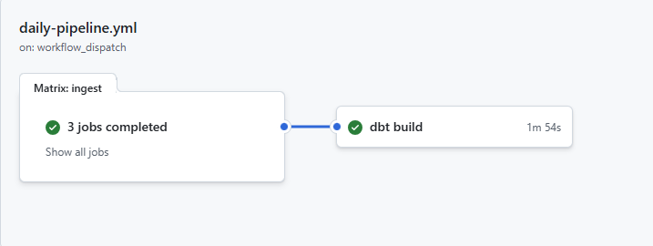 |
| CI | 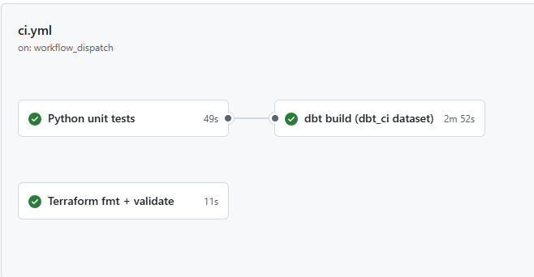 |
| dbt build | 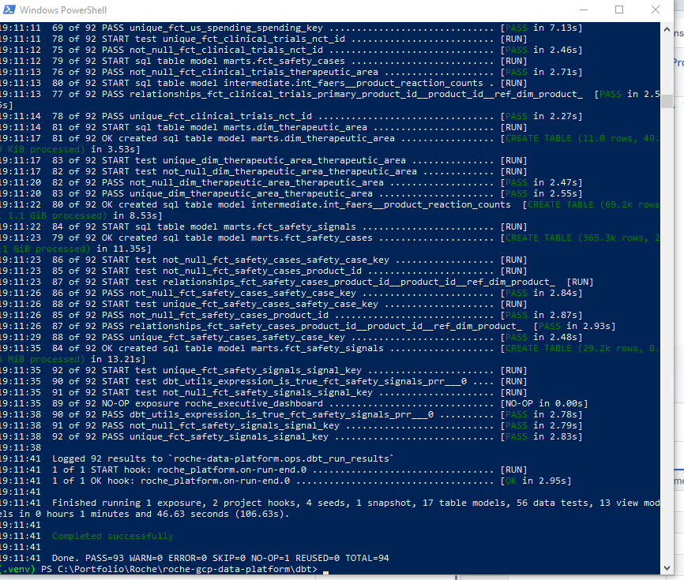 |
| PRR signals | 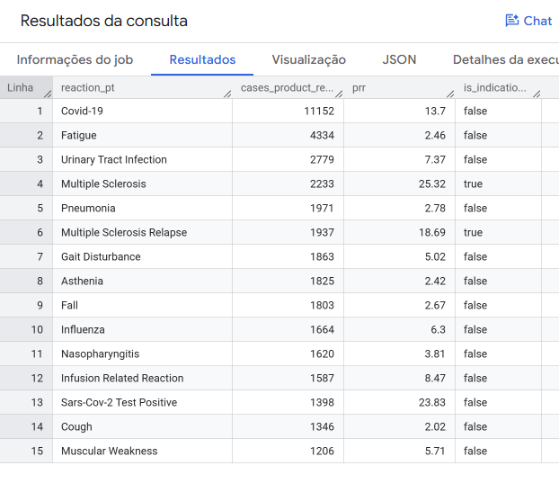 |

</details>

---

**Author:** João Paúra | Senior Data Analyst / BI & Data Engineering | [LinkedIn](https://linkedin.com/in/joaopaura) | [GitHub](https://github.com/joaopaura)
